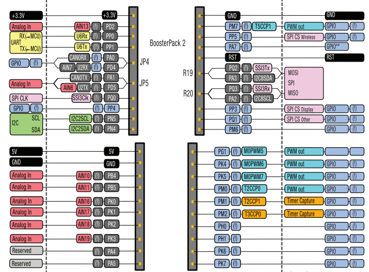

## SensorHub

### MCP2562
|Pin|Funktion|
|:---:|:----:|
|1|T<sub>XD</sub>|
|2|V<sub>SS</sub>|
|3|V<sub>DD</sub>|
|4|R<sub>XD</sub>|
|5|V<sub>IO</sub>|
|6|CANL|
|7|CANH|
|8|STBY|

### SUB D9
|Pin|Funktion|
|:---:|:----:|
|1||
|2|CANL|
|3||
|4|E-Switch|
|5|Charge-Switch|
|6|GND|
|7|CANH|
|8||
|9||

### aentron Stecker
|Pin|Funktion|
|:---:|:----:|
|1|CANL|
|2|CANH|
|3|GND|
|4|12V|
|5||
|6||
|7|Charge-Switch|
|8|E-Switch|

### DIP Schalter
|Nummer|Funktion|
|:---:|:----:|
|1|120 ohm|
|2|E-Switch|
|3|Charge-Switch|
|4|120 ohm|


### Json Tx Frame
```json
{"MsgData":"number","MsgID":"number","MsgIDMask":"number"}
```

### Topics
CAN/Tx<br />
CAN/Rx<br />
CAN/Voltage1<br />
CAN/Voltage2<br />
CAN/Voltage3<br />
CAN/Temperature1<br /> 
CAN/Temperature2<br />
CAN/Temperature3<br />




